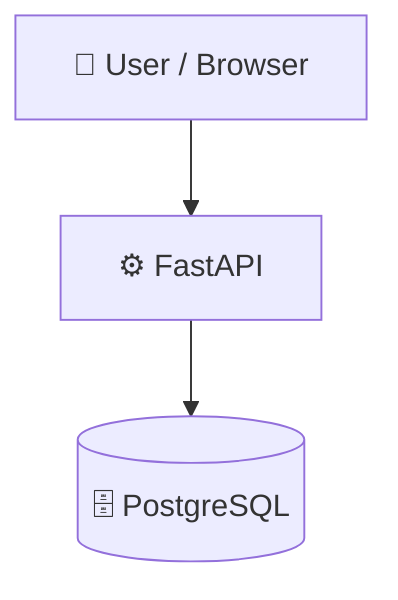

# SocialMediaApp-Backend
      
## 📑 Table of Contents
- [Description](#description)
- [Tech Stack](#tech-stack)
- [Architecture](#architecture)
- [Quick Start](#quick-start)
- [Project Structure](#project-structure)
- [Development Setup](#development-setup)
- [Database Migrations](#database-migrations)
- [Testing](#testing)
- [Contributors](#contributors)
- [Contributing](#contributing)
## 📝 Description
SocialMediaApp-Backend — a backend api built with FastAPI, PostgreSQL, Python.
## 🛠️ Tech Stack
- ⚡ **FastAPI**
- 🐘 **PostgreSQL**
- 🐍 **Python**
**Notable libraries:** Alembic, Uvicorn, pytest, sqlalchemy
## 🏗️ Architecture
A high-level view of how the main pieces fit together:

## ⚡ Quick Start
```bash
# 1. Clone the repository
git clone https://github.com/WafflesDevs/SocialMediaApp-Backend/tree/main.git
# 2. Create & activate a virtualenv
python -m venv venv && source venv/bin/activate
# 3. Install dependencies
pip install -r requirements.txt
# Run the API
uvicorn app.main:app --reload
```
## 📁 Project Structure
```
.
├── alembic
│   ├── README
│   ├── env.py
│   ├── script.py.mako
│   └── versions
│       ├── Updated DB verisons
├── alembic.ini
├── app
│   ├── __init__.py
│   ├── core
│   │   ├── config.py
│   │   ├── oauth2.py
│   │   └── utils.py
│   ├── db
│   │   └── database.py
│   ├── main.py
│   ├── models
│   │   └── models.py
│   ├── routers
│   │   ├── auth.py
│   │   ├── post.py
│   │   ├── user.py
│   │   └── vote.py
│   └── schemas
│       └── schemas.py
├── readme
└── requirements.txt
```
## 🛠️ Development Setup
### Python
1. Install Python (v3.10+ recommended)
2. `python -m venv venv && source venv/bin/activate`  (Windows: `venv\Scripts\activate`)
3. `pip install -r requirements.txt`

## 🗄️ Database Migrations

This project uses **Alembic** for database migrations alongside **SQLAlchemy** models. When adding a new column, you need to update **both** — Alembic applies the change to the actual database, and `models.py` tells SQLAlchemy the column exists so it's usable in code.

### Adding a New Column

**Step 1 — Update `app/models/models.py`**

Add the new column to the relevant model:

```python
class Post(Base):
    __tablename__ = "posts"

    id = Column(Integer, primary_key=True, nullable=False)
    title = Column(String, nullable=False)
    content = Column(String, nullable=False)
    published = Column(Boolean, server_default="TRUE", nullable=False)
    new_col = Column(String, nullable=True)  # 👈 add your new column here
```

**Step 2 — Generate the migration**

```bash
alembic revision --autogenerate -m "add new_col to posts"
```

This creates a new file under `alembic/versions/`. Review it before applying to make sure it looks correct.

**Step 3 — Apply the migration**

```bash
alembic upgrade head
```

### Other Useful Alembic Commands

```bash
# Check current migration version
alembic current

# View migration history
alembic history

# Roll back one migration
alembic downgrade -1

# Roll back all the way
alembic downgrade base
```

> **Note:** If you write a migration by hand instead of using `--autogenerate`, Alembic won't touch `models.py` — you still need to update the model manually.

## 🧪 Testing
This project uses **pytest** for testing.
```bash
pytest
```
## 👥 Contributors
Thanks to everyone who has contributed to this project:
<p align="left">
<a href="https://github.com/WafflesDevs" title="WafflesDevs"></a>
</p>

## 👥 Contributing
Contributions are welcome! Here's the standard flow:
1. **Fork** the repository
2. **Clone** your fork: `git clone https://github.com/WafflesDevs/SocialMediaApp-Backend/tree/main.git`
3. **Branch**: `git checkout -b feature/your-feature`
4. **Commit**: `git commit -m 'feat: add some feature'`
5. **Push**: `git push origin feature/your-feature`
6. **Open** a pull request
Please follow the existing code style and include tests for new behavior where applicable.
---
*This code took days to make! Please star it if you can! <3*
